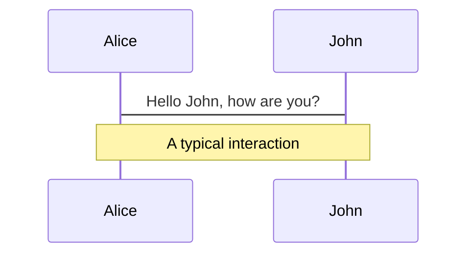

---
drawings:
  persist: false
---


# Slide 1

some
~~thing~~

<fxemoji-turtle class="text-8xl mx-auto" />


---

# Contents

<Toc />

---


# Slide 2
```cpp
#include<iostream>

int main(){
  return 0;
}

```

- This is a list
- of things


---




---

<v-clicks>

- Item 1
- Item 2
- Item 3
- Item 4

</v-clicks>

---
